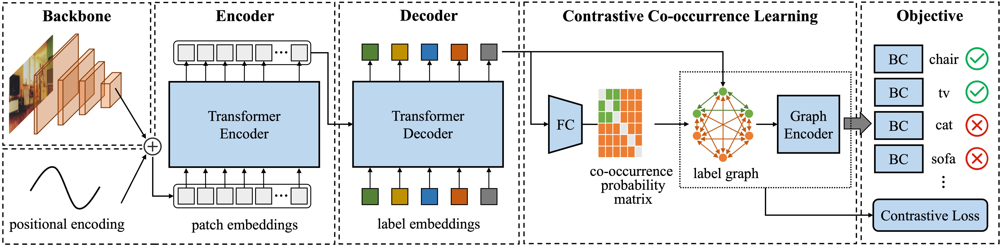

## Multi-Label Image Classification via Contrastive Co-occurrence Learning

### Introduction
This is an official PyTorch implementation of Multi-Label Image Classification via Contrastive Co-occurrence Learning, submitted to IEEE Transactions on Image Processing 2024. [[paper]]()




### Data Preparation
1. Download dataset and organize them as follow:
```
|datasets
|---- MSCOCO
|-------- annotations
|-------- train2014
|-------- val2014
|---- NUS-WIDE
|-------- Flickr
|-------- Groundtruth
|-------- ImageList
|-------- NUS_WID_Tags
|-------- Concepts81.txt
|---- VOC2007
|-------- Annotations
|-------- ImageSets
|-------- JPEGImages
|-------- SegmentationClass
|-------- SegmentationObject
|---- VisualGenome
|-------- ssgrl_partition
|------------ test_list_500.txt
|------------ train_list_500.txt
|------------ vg_category_500_labels_index.json
|-------- VG_100K
|-------- VG_100K_2
|-------- objects.json
```

2. Preprocess using following commands:
```bash
python scripts/mscoco.py
python scripts/nuswide.py
python scripts/voc2007.py
python scripts/vg500.py
```

### Requirements
```
torch >= 1.12.0
torchvision >= 0.13.0
```

### Training
One can use following commands to train model and reproduce the results reported in paper.
```bash
python train.py --model mlic --data voc2007 --batch-size 32 --pct-start 0.4 --ema-decay 0.9994 --gamma-neg 0.0 --num-steps 2 --amp
python train.py --model mlic --data mscoco --pct-start 0.4 --gamma-neg 1.0 --num-steps 1 --amp
python train.py --model mlic --data nuswide --num-steps 4 --pct-start 0.4 --gamma-neg 1.0 --amp
python train.py --model mlic --data vg500 --num-steps 2 --pct-start 0.2 --img-size 512 --amp
```
One can add `CUDA_VISIBLE_DEVICES=0,1,2,3` in front of the commands to enable distributed data parallel training with available GPUs.
### Evaluation

Pre-trained models are available in [link](https://pan.seu.edu.cn:443/link/524D2C7E5F89C0B2017AF5A746BD84BC). Download and put them in the `experiments` folder, then one can use following commands to reproduce results reported in paper.
```bash
python evaluate.py --exp-dir experiments/mlic_mscoco/exp1
```

### Citation
```
```
